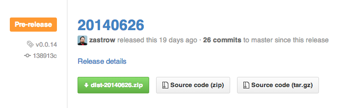
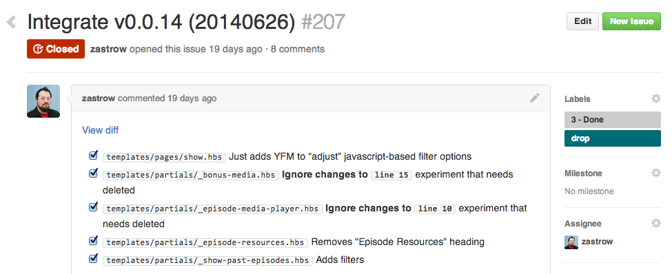
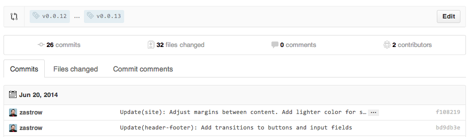

# Sparkbox Iterative Drops Process

We’ve found the following process to ease the handoff and integration of each increment where technologies often collide.  This is a model most appropriate when Sparkbox is not involved in the final CMS integration.

## Github

Sparkbox makes every effort to follow the [Github Flow][github-flow], keeping `master` as clean as possible and ready for delivery.  Our commits attempt to follow [a common pattern][sparkbox-git-style], and we make every effort to ensure [code reviews][sparkbox-code-reviews] happen in all cases.  Each of these is meant to help with collaboration within our team and with delivery to our clients.

## Cadence

As soon as the website build is underway, we’ll work with the integration team to coordinate a weekly or twice-weekly integration meeting.  Commonly held Monday/Thursday or Tuesday/Friday, this meeting has two parts:

__Integration Review__ is an opportunity for the integration team to demonstrate the current state of what has been integrated.  All efforts are made to do this in a shared environment, such as a Development, Test, or QA server.  In most cases, this is a formality, but at times, we may catch design elements that haven’t integrated appropriately.

__Drop Preview__ is the Sparkbox team’s opportunity to share the latest increment of the HTML, CSS, Javascript, and any assets that are ready for integration.  This is a great time to point out refactorings, data element sources from the [Content Priority Guide][sparkbox-content-priority], and other "gotchas."

## Drops

Each Integration Review will include a new Drop containing completed features or changes.  A drop consists of both a Github Release and Github Issue to track the integration.

__Github Release__ contains a compressed version of the built website called dist.zip.  Github Releases inherently create a Git Tag that we use in the Issue that is linked in the release description.

__Github Issue__ will detail the Handlebar’s templates that have been changed for this drop as subtasks.  We’ll often include notes about the type of changes that we made to help integration find changes or new templates.

Also included is a link to view the differences between the previous Release Tag and this new Release Tag.  This can be really helpful when a drop includes refactorings or other changes that might be challenging to translate.

[github-flow]: https://guides.github.com/introduction/flow/index.html
[sparkbox-git-style]: https://github.com/sparkbox/how_to/tree/master/style/git
[sparkbox-code-reviews]: https://github.com/sparkbox/how_to/tree/master/style/code_reviews
[sparkbox-content-priority]: https://seesparkbox.com/foundry/content_priority_guide
