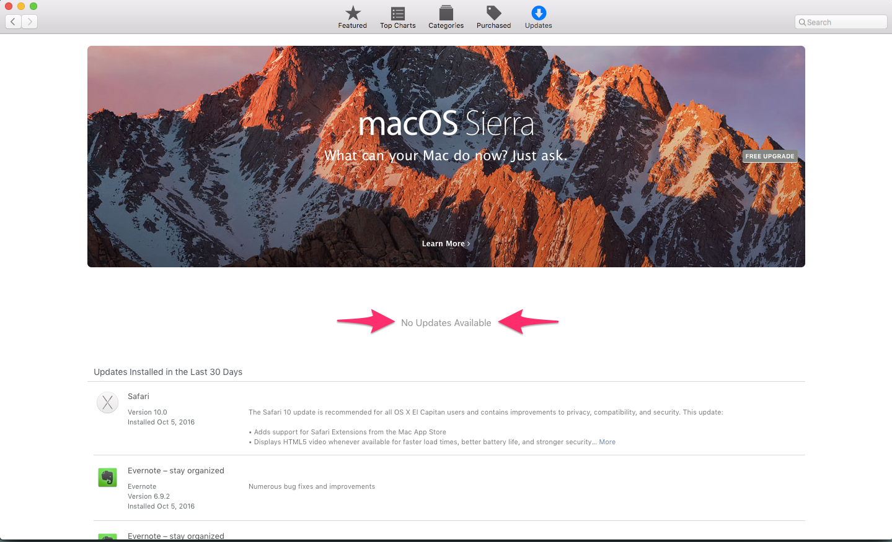

## Recommended Mac Updates

## Capturing Status on the Command Line

macOS ships with a tool called `softwareupdate` to scan, list, download, and
install updates. If you're comfortable with typing in commands, you can see if
recommended updates are available:

  sudo softwareupdate -l

The message _No updates are available._ will print at the end.

## Capturing Status from the App Store

You can check for updates from the App Store. From the Apple menu ()
click on `App Store`, followed by `Updates` on the top row. You should see the
message _No Updates Available_.

## Installing Updates on the Command Line

You can install updates from the command line using the `softwareupdate` tool.
To install recommended updates with progress indication run:

  sudo softwareupdate -ir --verbose

## Installing Updates from the App Store

You can install updates from the App Store. From the Apple menu () click on 
`App Store`, followed by `Updates` on the top row. You can install individual
updates by clicking `Install` or install all updates by clicking `Install All`.
