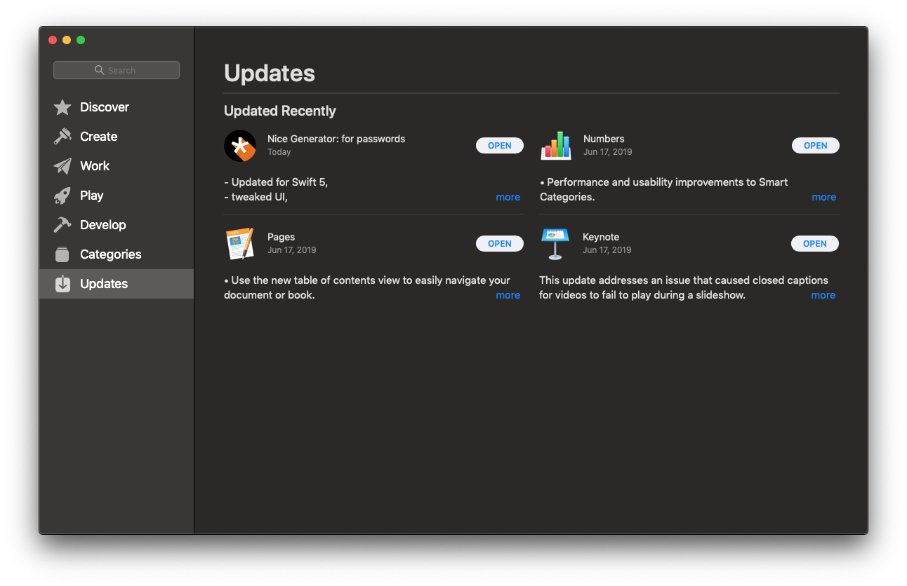
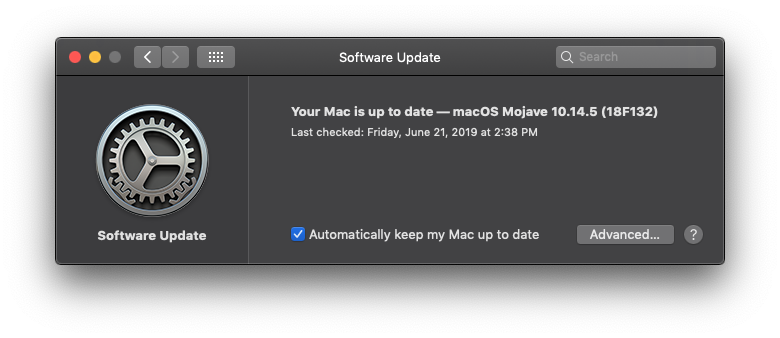

## Recommended Mac Updates

## Capturing Status on the Command Line

macOS ships with a tool called `softwareupdate` to scan, list, download, and
install updates. If you're comfortable with typing in commands, you can see if
recommended updates are available:

    $ sudo softwareupdate -l

The message _No updates are available._ will print at the end.

## Capturing Status from the App Store

You can check for non-system updates from the App Store. From the Apple menu ()
click on `App Store`, followed by `Updates` on the sidebar. You should not see any
available updates.

## Capturing Status from System Preferences

You can check for system updates from System Preferences. From the Apple menu ()
click on `System Preferences`, followed by `Software Update`. You should see a
message that includes _Your Mac is up to date_.

## Installing Updates on the Command Line

You can install updates from the command line using the `softwareupdate` tool.
To install recommended updates with progress indication run:

    $ sudo softwareupdate -ir --verbose

## Installing Updates from the App Store

You can install non-system updates from the App Store. From the Apple menu () 
click on `App Store`, followed by `Updates` on the sidebar. You can install individual
updates by clicking `Install` or install all updates by clicking `Install All`.

## Installing Updates from System Preferences

You can install system updates from from System Preferences. From the Apple 
menu () click on `System Preferences`, followed by `Software Update`. If any 
updates are available, click the Update Now button to install them.