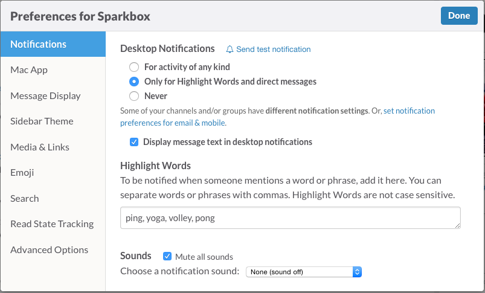

Slack
========

[![Image of Sack][producti]][product]

Our team communication platform because we like to talk to each other.

[product]: https://slack.com/
[producti]: http://i.imgur.com/0u1iR8W.png

## Channels

Slack allows us to create channels to talk to everyone at once, think chat room.

### General & Random

By default slack has two channels, General and Random, and all users are added. General is a place to talk about non work related stuff and Random is a scary place of pure randomness.

### Public Channels

Additional channels have been created which any memember of the Sparkbox team can join at any time. These channels cover a range of topics from discussion on design, to video games, to weekly lunches. Any member of the team can start a new channel or join an existing one. There are currently over 150 channels.

### ext-

Some channels begin with and ext-, these channels allow clients to join in on the conversation.

## Direct Messages

Not all conversations have to be public. If you need to say something in private you can send a direct message, think Instant Messenger.

## Notifications

Get notified when someone mentions you in conversation, sends you a direct message or setup a list of keywords to be notified when someone mentions something important, like ping pong.

### Twitter

Slack really likes to keep everyone in the loop so it shares Twitter notifications. When someone mentions [@hearsparkbox](https://twitter.com/hearsparkbox) on Twitter it shows up in the General channel for all Sparkboxers to see.

## The App

We can stay in the loop even when we are out of the office with the [mobile app](https://itunes.apple.com/us/app/slack-team-communication/id618783545?mt=8).
