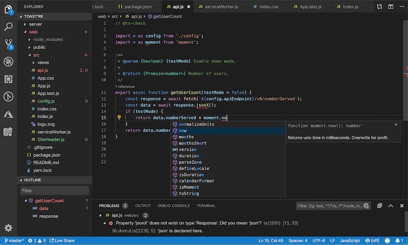

# Visual Studio Code (VS Code)

Visual Studio Code is a [popular](https://insights.stackoverflow.com/survey/2019?utm_source=Iterable&utm_medium=email&utm_campaign=dev-survey-2019#technology-_-most-popular-development-environments) and versatile code editor from Microsoft with support for a variety programming languages.